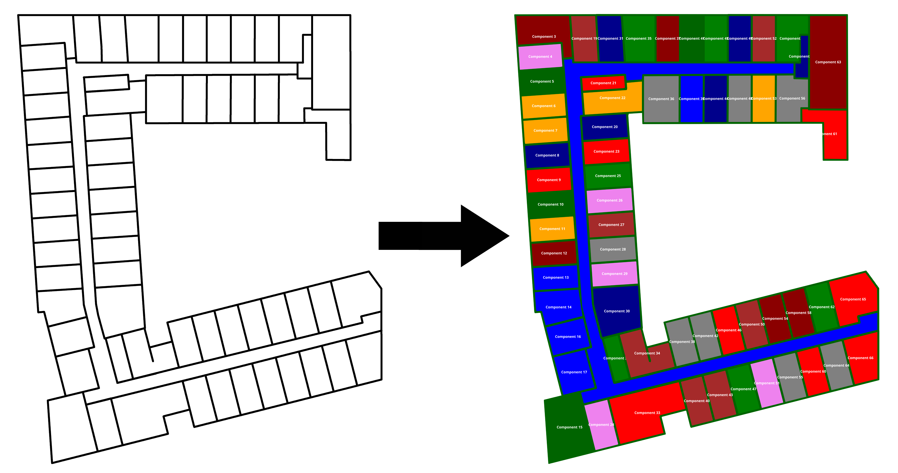

# pngtrace

Simple Python tool that partitions a png file into connected components (by color similarity) and for
each component finds a minimal polygonal chain enclosing it as well as its center.



The program works under many assumptions on the regularity of the image. In particular, the image is required
to have an external connected component surrounding the main content on all sides. This extra component is
not considered in the output.

## Usage
```
python trace.py <your_image>
```
The program is quite slow and depending on the image size it can have a high RAM usage. Make sure you
have at leat `16GB` available. In case of segmentation faults, you might need to increase the stack size
with `ulimit -s unlimited`.

This program writes its output to the file `output.json` and also shows a preview of the result. You might need
to tweak some of the parameters at the beginning of the file `trace.py` to adjust the result to your needs.
You can also convert the output to an svg image with
```
python create_svg.py output.json
```
